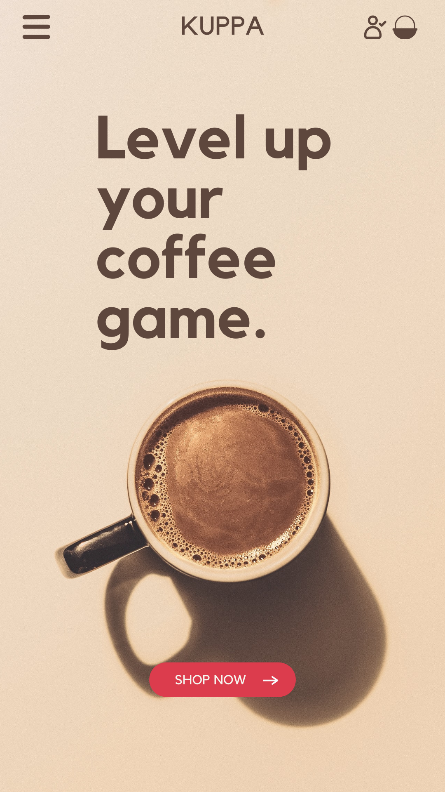
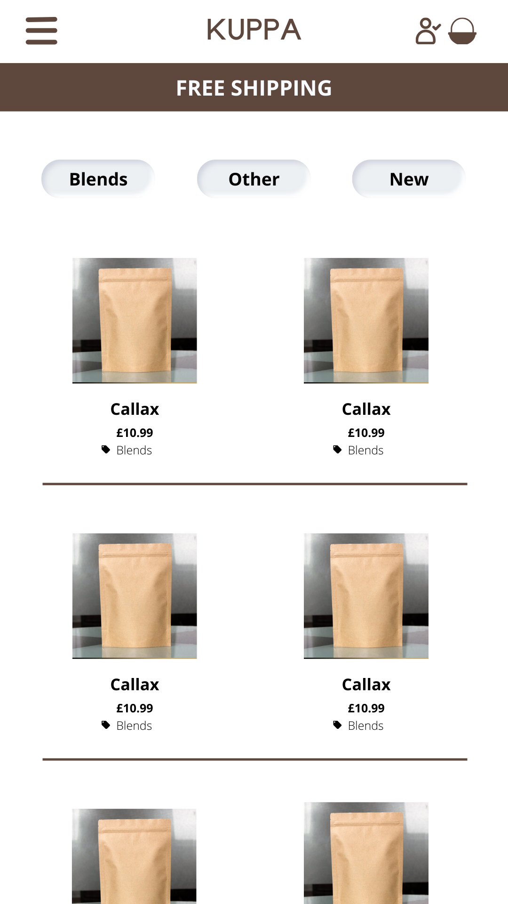
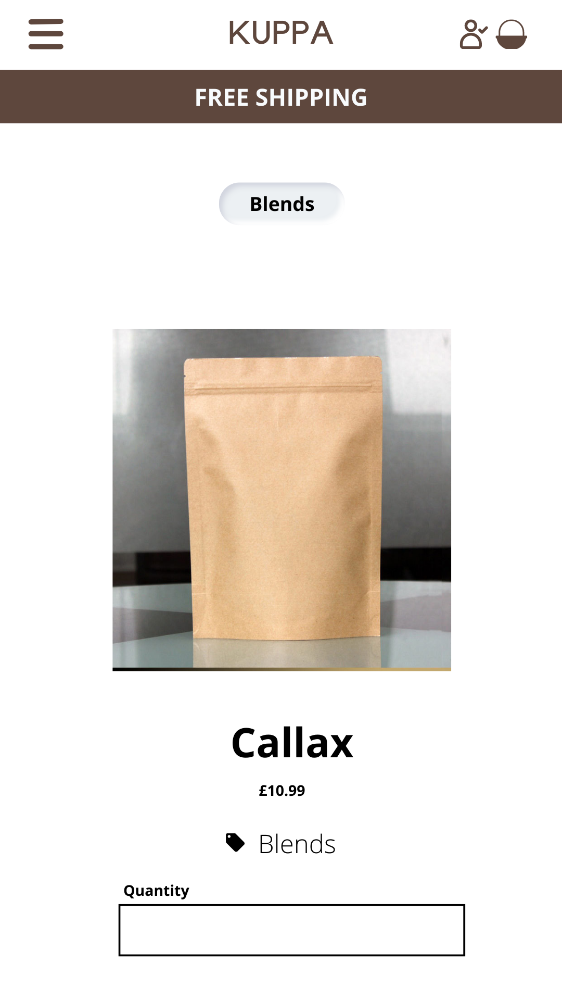
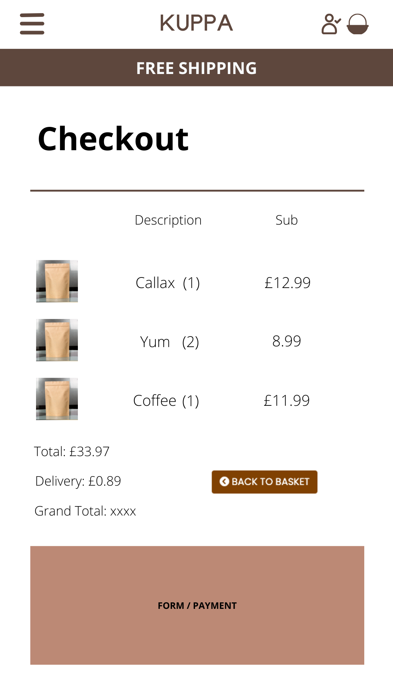
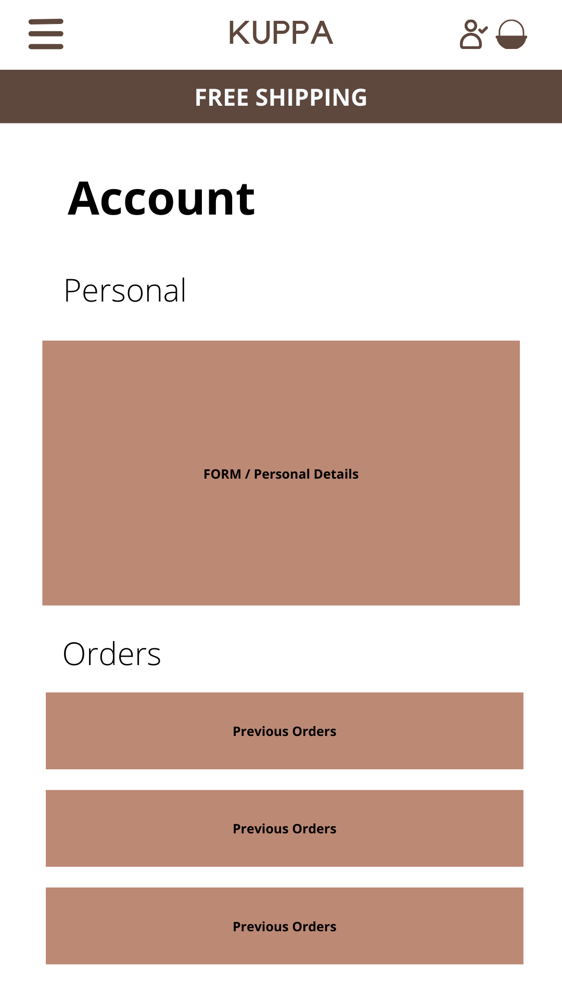
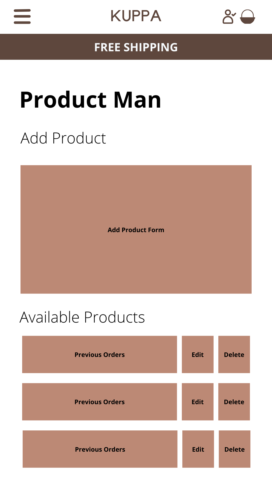

# KUPPA overview

KUPPA is a ecommerce store built with Django.

This is for demonstration purposes only and will be used for my final Code Institute module. This is a public repo so forking and cloning is accepted. Alternatively if you have any suggestions for features and or bug fixes please contact me.

## Table Of Contents

- [User Experience](#UX)
- [Design](#Design)
- [Technology / Features](#Technology)
- [Testing](#Testing)
- [Deployment](#Deployment)
- [Credit](#Credit)
- [Future Features](#Features)

## UX

### 1. First time user - as a first time user I would like to

- Understand what the site sells
- Easily navigate to products
- Easily see details for a specific product
- See clear calls to action
- See products for sale
- See some visuals to entice me in
- Easily search for products

### 2. Returning user - as a returning user I would like to

- Sign up / Register for easy purchasing
- Easily log in
- Have access to my account page
- See the brand contact details
- See the brands socials
- Sort products by price
- Sort products by Name
- Sort products by Category
- Sort products by Rating
- See a visual aid that my payment is in process

### 3. Frequent user - as a frequent user I would like to

- See my previous orders
- Delete my account
- Update my profile information
- Have my order info pre-populated
- IF ADMIN, have access to add products
- IF ADMIN, have access to edit products
- IF ADMIN, have access to remove products
- IF ADMIN, have access to all orders
- IF ADMIN, have access to an admin panel

## Design

### Strategy

- The site strategy was to build a product that was free of clutter, leaving customers with an easy to access and easy to understand ecommerce platform for buying coffee and coffee related accessories.

### Scope

- The scope (apps) of the project where as follows

1) Home
2) Products
3) Basket
4) Checkout
5) Accounts

### Structure

- The structure of the ecommerce platform allows customer to easily navigate the site from products to understanding more about the business and its goals. Customers can also easily sign up and save their details making the process as easy and seamless as possible

### Skeleton

- All site functionality is linked around a user and their profile. Customers can buy without signing up but have more functionality and information once they are signed up. All products are grouped by category making it easy for customers to understand their options.

### Surface

- The live site keeps to a minimalistic ethos and colour scheme allowing customers to feel connected to the brand, keeping confusion and complexity away. All functionality leads to products and then to basket and checkout, always allowing customers the option to sign up or sign in to drive more business to KUPPA.

1) Index

2) Products

3) Product Details

4) Checkout

5) Account

6) Product Management

See readme > images for more images of design

[README Images](https://github.com/joshcallawaydev/kuppa/tree/main/README/images)

### Color scheme

The colour scheme was chosen to match that of the ecommerce platforms main seller - coffee.

1) Main colour - #804102
2) Secondary colour - #fff
3) Third colour - #000

### Typography

My primary font was taken from Google fonts (https://fonts.google.com/).

1) Primary font - Poppins
2) Secondary font - Helvetica
3) Third font - sans-serif

### Sizing

I chose REM as the primary unit due to its flexibility with responsive design. I have also used PX where necessary for absolute sizing.

### Imagery

PLEASE NOTE I DO NOT OWN THE RIGHTS TO THESE IMAGES AND THEY ARE USED FOR DEMONSTRATION PURPOSES ONLY.

Original images were taken from the online resources and some links can be found below.

Some images were updated in Canva to show the KUPPA logo. Again, this is for demo purposes only and would not be used in a real site or for monetary gain.

With more time I would add further images to differentiate the products.

### UI / Mockups

All Index/Home page images were taken from unsplash.

1) https://images.unsplash.com/photo-1506619216599-9d16d0903dfd?ixlib=rb-1.2.1&q=80&fm=jpg&crop=entropy&cs=tinysrgb&dl=jakub-dziubak-XtUd5SiX464-unsplash.jpg

2) https://images.unsplash.com/photo-1541167760496-1628856ab772?ixlib=rb-1.2.1&q=80&fm=jpg&crop=entropy&cs=tinysrgb&dl=fahmi-fakhrudin-nzyzAUsbV0M-unsplash.jpg

3) https://images.unsplash.com/photo-1559496417-e7f25cb247f3?ixlib=rb-1.2.1&q=80&fm=jpg&crop=entropy&cs=tinysrgb&dl=jarek-ceborski-IhqDpFz7I8Q-unsplash.jpg

4) https://images.unsplash.com/photo-1485808191679-5f86510681a2?ixlib=rb-1.2.1&q=80&fm=jpg&crop=entropy&cs=tinysrgb&dl=jeremy-yap-jn-HaGWe4yw-unsplash.jpg

5) https://images.unsplash.com/photo-1592663527359-cf6642f54cff?ixlib=rb-1.2.1&q=80&fm=jpg&crop=entropy&cs=tinysrgb&dl=tabitha-turner-F0Wd4djYvSA-unsplash.jpg

6) https://images.unsplash.com/photo-1610632380989-680fe40816c6?ixlib=rb-1.2.1&q=80&fm=jpg&crop=entropy&cs=tinysrgb&dl=ante-samarzija-lsmu0rUhUOk-unsplash.jpg

7) https://images.unsplash.com/photo-1518832553480-cd0e625ed3e6?ixlib=rb-1.2.1&q=80&fm=jpg&crop=entropy&cs=tinysrgb&dl=jessica-lewis-Am2kjOEKADs-unsplash.jpg

## Technology

### Languages

- HTML5
- CSS3
- JavaScript (jQuery)
- Python / (Django)
- SQLite

### Frameworks / Features

- Bootstrap
- Google Fonts
- Django
- Jinja
- Balsamiq
- Responsive Design
- Mobile First
- Font Awesome
- Stripe

### Imports / Extras

- asgiref==3.5.0
- black==22.3.0
- click==8.1.3
- Django==3.2
- django-allauth==0.41.0
- django-countries==7.2.1
- django-crispy-forms==1.14.0
- oauthlib==3.2.0
- pathspec==0.9.0
- Pillow==9.1.0
- python-dotenv==0.20.0
- python3-openid==3.2.0
- pytz==2022.1
- requests-oauthlib==1.3.1
- sqlparse==0.4.2
- stripe==3.1.0

- render
- get_object_or_404
- login_required
- messages
- path
- AppConfig
- forms (crispy)
- models
- User
- post_save
- receiver
- session
- CountryField
- path
- HttpResponse
- redirect
- Decimal
- os
- json
- reverse
- require_POST
- Sum
- render_to_string
- csrf_exempt
- Q
- Lower

See requirements.txt for imports and versions

## Testing

See TESTING.md

[Testing](https://github.com/joshcallawaydev/kuppa/blob/main/README/TESTING.md)

Stripe testing was performed in stripe developer mode. For card details, please see stripe developer documentation.

## Deployment

For deployment, see DEPLOYMENT.md via the link below.

[Deployment folder](https://github.com/joshcallawaydev/kuppa/tree/main/README/DEPLOYMENT.md)

## Credit

Payment functionality was supported by the Booutique Ado project alongside the code snippets in the Stripe Documentation.

## Features

Database / Schema

Visual representation of db in link below

[database](https://github.com/joshcallawaydev/kuppa/blob/main/db.json)

Payments

Payment integration was added with Stripe.com

I used stripe for its ease of use. With just a few copy and paste code snippets, and setting up STRIPE_PUBLIC and PRIVATE keys you can have a fully functional payment system.

WEBHOOKS were set up using the WEBHOOK URL and KEYS but further development on this would be needed for a publishable ecommerce platform.

For test payments please use:

Card - 4242 4242 4242 4242
Exp - 0424
CSV 424
ZIP/POST - 242442

[Stripe Docs](https://stripe.com/docs/testing)

## Future Features

1) add option for changing coffee bag sizes
2) update the inbuilt django widgets to more customizable look and feel
3) option to add favourites
4) social media logins
5) add more to terms of service and privacy policy
