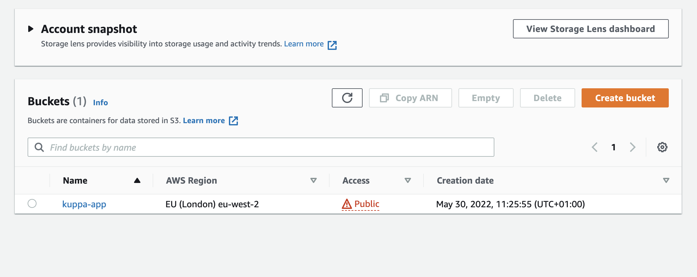
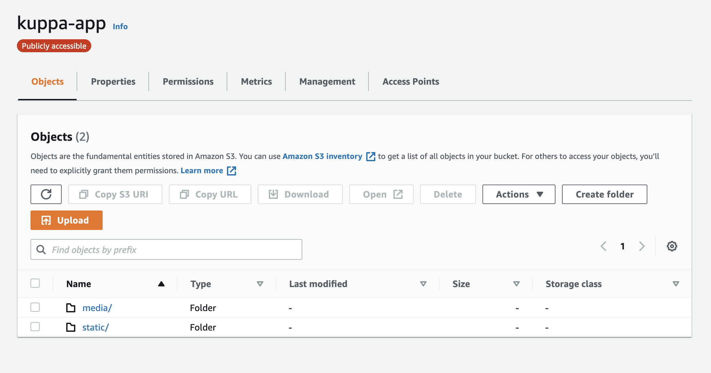

# Deployment

The site is deployed with Heroku. I chose Heroku for its ease of use and ability to support backend features. Code is tested and matches that of the dev environemtn and is free of commented out code.

## Deployment instructions

Heroku requires these files to run:

### Prerequisites

- requirements.txt
- Procfile

#### Instructions

1) In Heroku, click new and create an app with a unique name
2) Choose region and click 'Create App'
3) Select GitHub as Deployment method
4) Type in repo name and click search then connect

How to find variables to define in env.py...

1) Click on Settings tab
2) Click on Reveal Config Vars

Deploying app

1) Click on Deploy tab
2) enable automatic deploys
3) Click deploy branch. Make sure the master branch is selected
4) You should see your app was successfully deployed

# Static File Storage

All static file and images are stored in AWS - Using the S3 bucket feature

I used an AWS S3 bucket for its easy python integration and free tier usage.

Bucket images

# Fork / Cloning

## Forking

By forking the GitHub Repo, you make a copy of the original repository on your GitHub account to view and/or make changes without affecting the original repo. To do this, please follow the below steps...

1) Log in to GitHub and navigate to the GitHub Repo
2) At the top of the Repo (not top of the page) just above the "Settings" Button on the menu, locate the fork Button
3) Click the fork button
4) You should now have a copy of the original repo in your GitHub

## Cloning

1) Log in to GitHub and locate the GitHub Repo
2) Under the repo name, click 'code' to veiw the repo URL or download the ZIPPED file.
3) To clone the repo using HTTPS, under "Clone with HTTPS", copy the link.
4) Open terminal
5) Change the current working directory to the location where you want the cloned directory to be made.
6) Type git clone, and then paste the URL you copied in Step 3. $ git clone https://github.com/*repo-name*
7) Press Enter. Your local clone will be created.