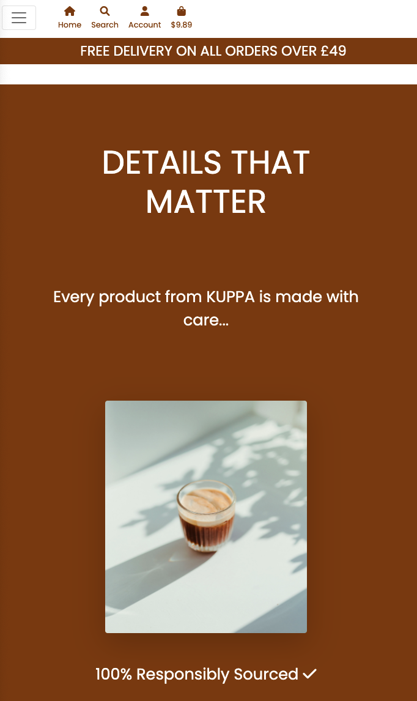

# Testing

All testing was performed to ensure a robust and reliable product and is crucial to a project delivery.

Below is the testing performed on this project. Testing was compiled throughout the project in effort to minimise bugs and styling issues.

# Table of contents

* [User stories](#User-stories)
* [Dev Tools Testing](#Dev-Tools-Testing)
* [Validators](#Validators)
* [Other testing](#Other)

# User stories

### 1. First time user - as a first-time user I would like to

Understand what the site sells

Easily navigate to products

Easily see details for a specific product

See clear calls to action

See products for sale

See some visuals

Easily search for products

See trending products

### 2. Returning user - as a returning user I would like to

Sign up / Register for easy purchasing

Easily log in to accounts

Have access to my account page

See the brand contact details

See the brands socials

Sort products by price

Sort products by Name

Sort products by Category

Sort products by Rating

See a visual aid that my payment is in process

### 3. Frequent user - as a frequent user I would like to

See my previous orders

Update my profile information

Have my order info pre-populated

IF ADMIN, have access to add products

IF ADMIN, have access to edit products

IF ADMIN, have access to remove products

IF ADMIN, have access to all orders

IF ADMIN, have access to an admin panel

Add products to my favourites

Set a favourite product, category and order frequency

# Dev Tools Testing

Lighthouse

Cross browser
Firefox

Responsiveness

Some issues at small screen sizes on the add product page however this I am happy with as these features, including admin dashboard would be mainly desktop use I believe. - I have sliced text to fix this issue partially.

# Validators

HTML

All pages tested, errors removed and only some warning visible.

CSS

JS - beautifytools

Python

All python has been formatted with Black, Autopep8 and Pylance to ensure PEP8 standard where possible.

### Navigation

All navigation was tested, both mobile and large viewports

### Products

All links and images tested on products

### Basket

All basket functionality and sums tested

### Checkout / Payments

All checkout links functionality and payment tested

### Account

All account functionality and links tested

### Product Management

All product management tested

### Other Images

Favicon would not load

Images would not Render

Search bar issue

Testing the buttons

Testing the links

Testing the links

Form name field

Leaving name field blank on populated form to add level of checking to customer
Security / Authentication

Permissions

More mobile tests

Favourites testing

Trending products testing

With more time I would like to have used automated testing more. The testing was thorough but more automated testing would be better for robustness.
